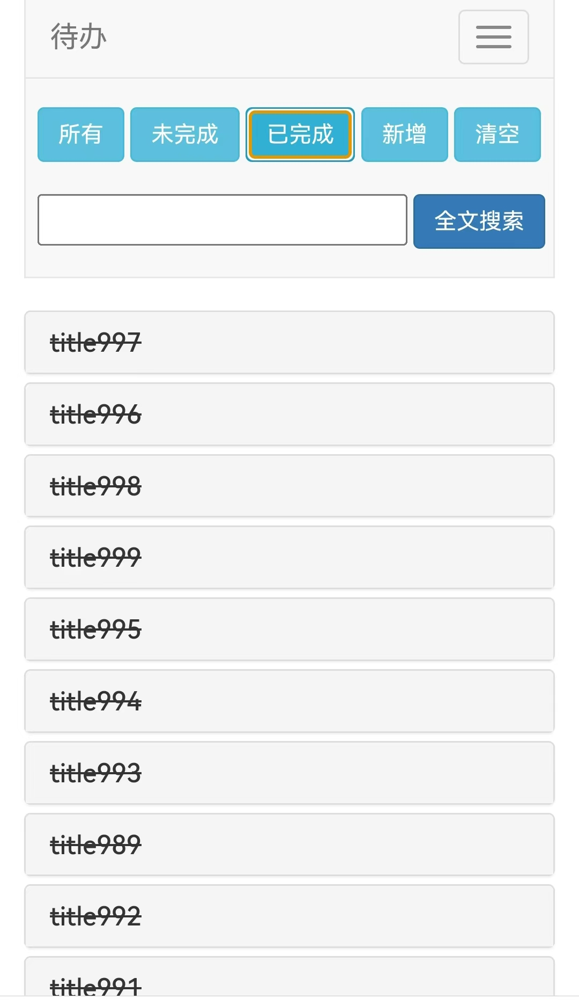

# Todo-app

## 前端

前端使用 bootstrap3 开发, 只有一个 ./html/todo.html 文件, 访问 /todo.html 路由即可使用, 手机端、平板端、电脑端大小自适应。

界面部分截图如下:

## 后端

后端采用 springboot3+jdk17 开发, 使用 jpa 作为 orm, 使用 mysql 数据库, 使用 控制层、服务层、数据库层 三层开发模式, 集成 swagger-ui, 访问 /swagger-ui.html 路由。

`/swagger-ui.html` 截图如下:

## 使用说明

运行服务前需要提前安装 jdk17+ ,并配置 jdk 路径到系统环境中, 即使用命令 `java --version` 输出 jdk 版本大于或等于17。

从 release 页面中下载对应版本的压缩包, 解压后根据自己的情况修改 application-pro.properties 文件中的属性, 之后运行 run.bat 即可运行服务（目前只提供了 windows 版本的启动脚本, 其他系统请参考 windows 版本的启动脚本进行修改）

## 二次开发

代码有三种环境, dev(开发环境)、test(测试环境) 和 pro(正式环境)。

dev 环境中, 通过 spring.profiles.active=dev 来激活 dev 环境的配置文件, mvn 运行时请指定 dev 模式。 dev 模式使用本地 h2 数据库进行开发。

test 环境中, 通过 spring.profiles.active=test 来激活 test 环境的配置文件, mvn 运行时请指定 test 模式, test 模式使用本地 mysql 数据进行测试。测试数据在 src/test/resources。

pro 环境中, mvn 运行时请指定 pro 模式对整个项目进行打包, 打包成 jar 包, 将打包的 jar 包、 application-pro.properties、html 文件夹、run.bat 文件放在同一个文件夹下, 通过修改 application-pro.properties 来适应正式环境, 通过 run.bat 启动服务（目前只提供了 windows 版本的启动脚本, 其他系统请参考 windows 版本的启动脚本进行修改）。 

##  版本日志

- 1.0.0 初步完成 待办 工具

